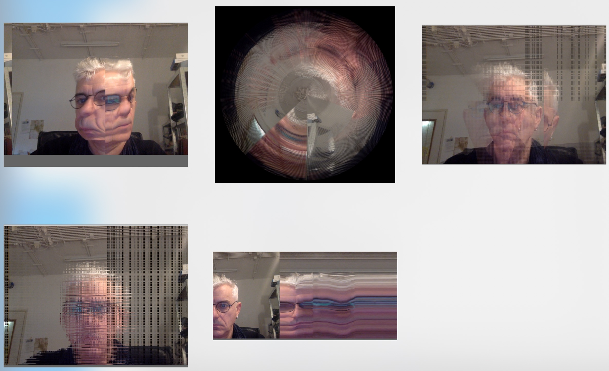

# SlitScan camera - three ways

https://github.com/danbz

for openframeworks video tutorials and more 

https://www.youtube.com/playlist?list=PL6QF0yo3Zj7ALxV4MyOJ9oSFsV-Mo39R2

Dan Buzzo, December 2019

https://github.com/danbz

https://buzzo.com

#Slitscan 3 ways

code in C++ using openFrameworks.cc for three ways slitscannning

included is a compiled binary for OSX

 
